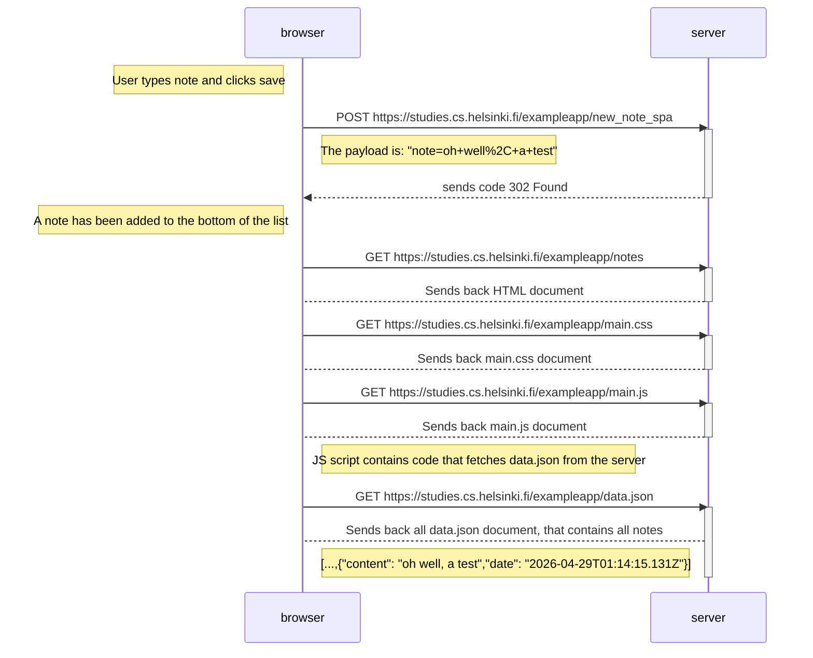

```mermaid
sequenceDiagram
    participant browser
    participant server


    Note left of browser: User types note and clicks save
    browser->>server: POST https://studies.cs.helsinki.fi/exampleapp/new_note_spa
    activate server
    Note right of browser: The payload is: "note=oh+well%2C+a+test"
    server-->>browser: sends code 302 Found
    deactivate server
    Note left of browser: A note has been added to the bottom of the list

    browser->>server: GET https://studies.cs.helsinki.fi/exampleapp/notes
    activate server
    server-->browser: Sends back HTML document
    deactivate server

    browser->>server: GET https://studies.cs.helsinki.fi/exampleapp/main.css
    activate server
    server-->browser: Sends back main.css document
    deactivate server

    browser->>server: GET https://studies.cs.helsinki.fi/exampleapp/main.js
    activate server
    server-->browser: Sends back main.js document
    deactivate server
    Note right of browser: JS script contains code that fetches data.json from the server
    browser->>server: GET https://studies.cs.helsinki.fi/exampleapp/data.json
    activate server 

    server-->browser: Sends back all data.json document, that contains all notes
    Note right of browser: [...,{"content": "oh well, a test","date": "2026-04-29T01:14:15.131Z"}]
    deactivate server

```

    
