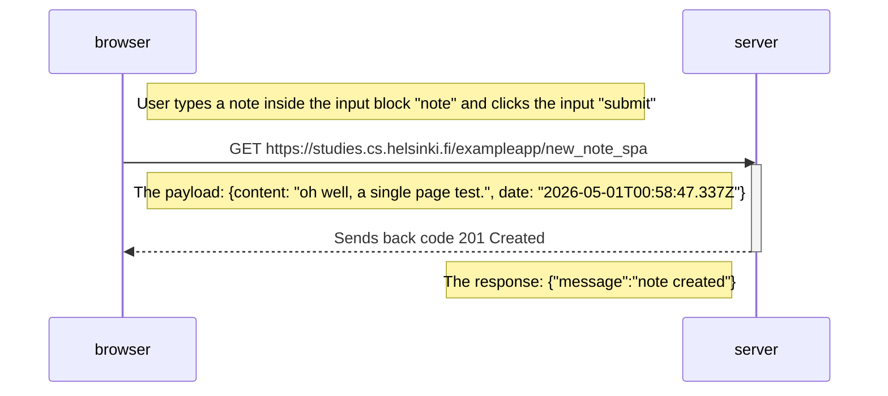

```mermaid
sequenceDiagram

    participant browser
    participant server

    Note right of browser: User types a note inside the input block "note" and clicks the input "submit"
    browser->>server: GET https://studies.cs.helsinki.fi/exampleapp/new_note_spa
    activate server
    Note right of browser: The payload: {content: "oh well, a single page test.", date: "2026-05-01T00:58:47.337Z"}
    server-->>browser: Sends back code 201 Created
    deactivate server
    Note left of server: The response: {"message":"note created"}


```